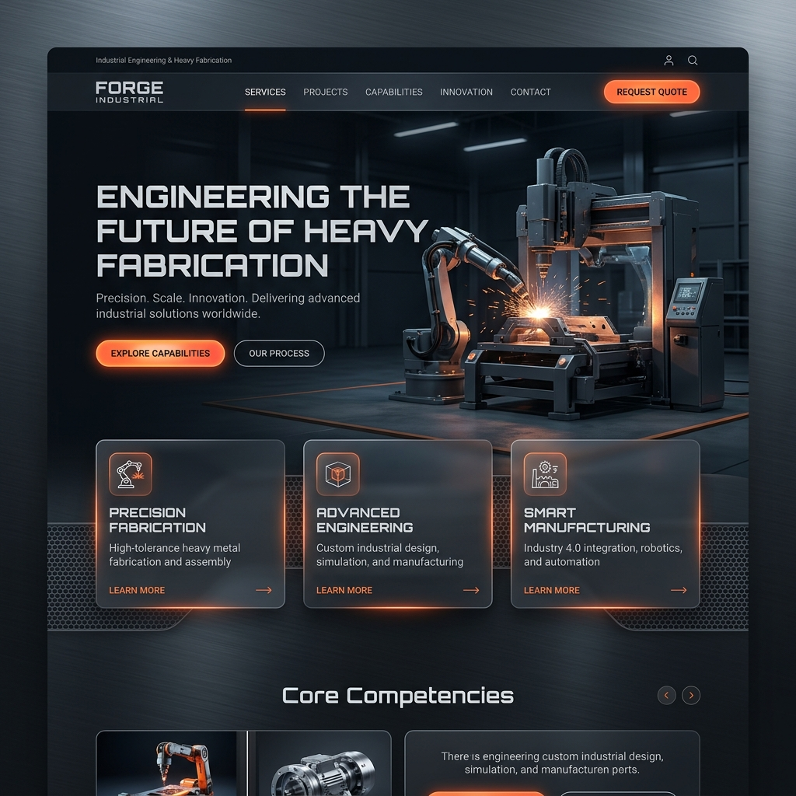

# Frontend Design Ideas

Based on your current website, here are two completely different UI directions for the new frontend. You can find these images directly in your folder.

````carousel

<!-- slide -->

````

### Option 1: Modern & High-Tech (Dark Mode)
- **Vibe:** Cutting-edge, premium, and industrial.
- **Features:** Deep steel gray backgrounds, brushed metal textures, vibrant neon orange accents, and glassmorphism (frosted glass) cards for services.
- **Best for:** Making a bold statement and standing out as an innovative industry leader.

### Option 2: Clean Corporate (Light Mode)
- **Vibe:** Professional, trustworthy, and authoritative.
- **Features:** Crisp white backgrounds, navy blue secondary colors, strong orange call-to-action buttons, and sharp typography.
- **Best for:** Conveying reliability, safety, and an established corporate presence.

Let me know which direction you prefer (or if you want a mix of both), and I can start implementing these frontend changes into your React code!
