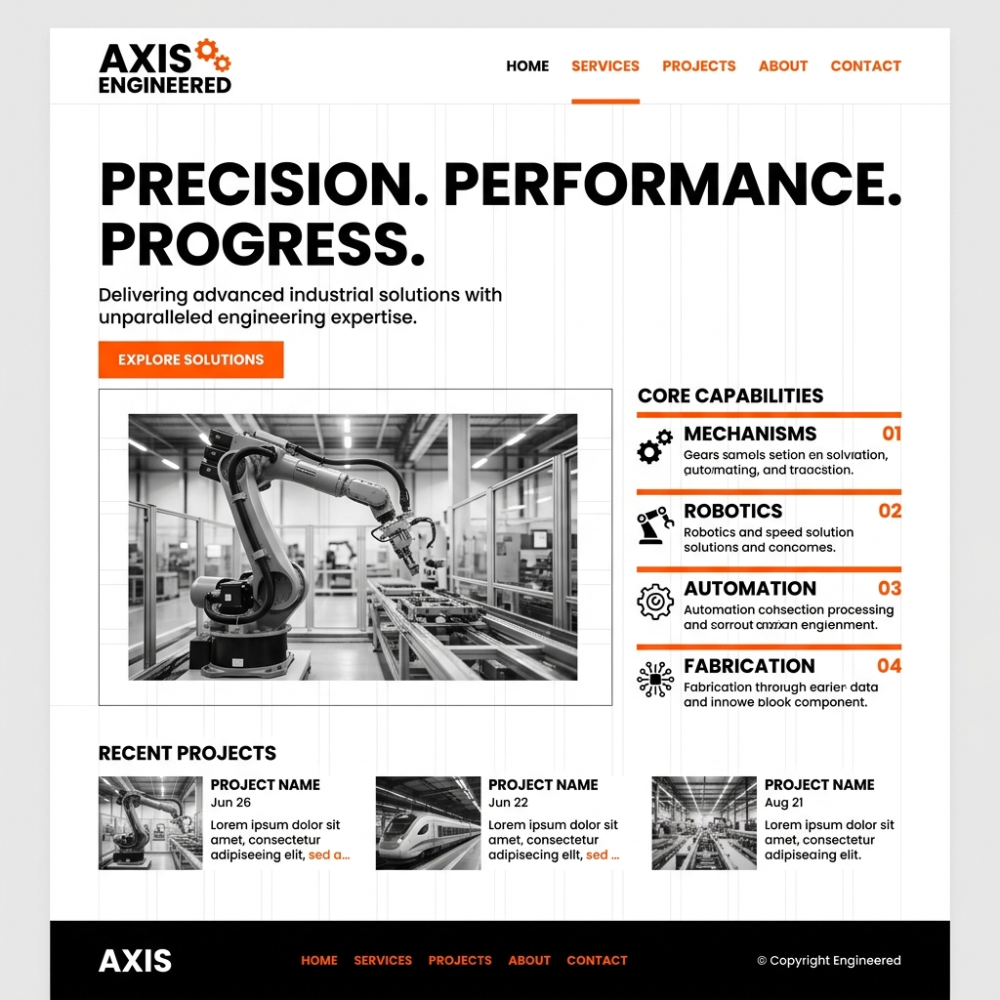
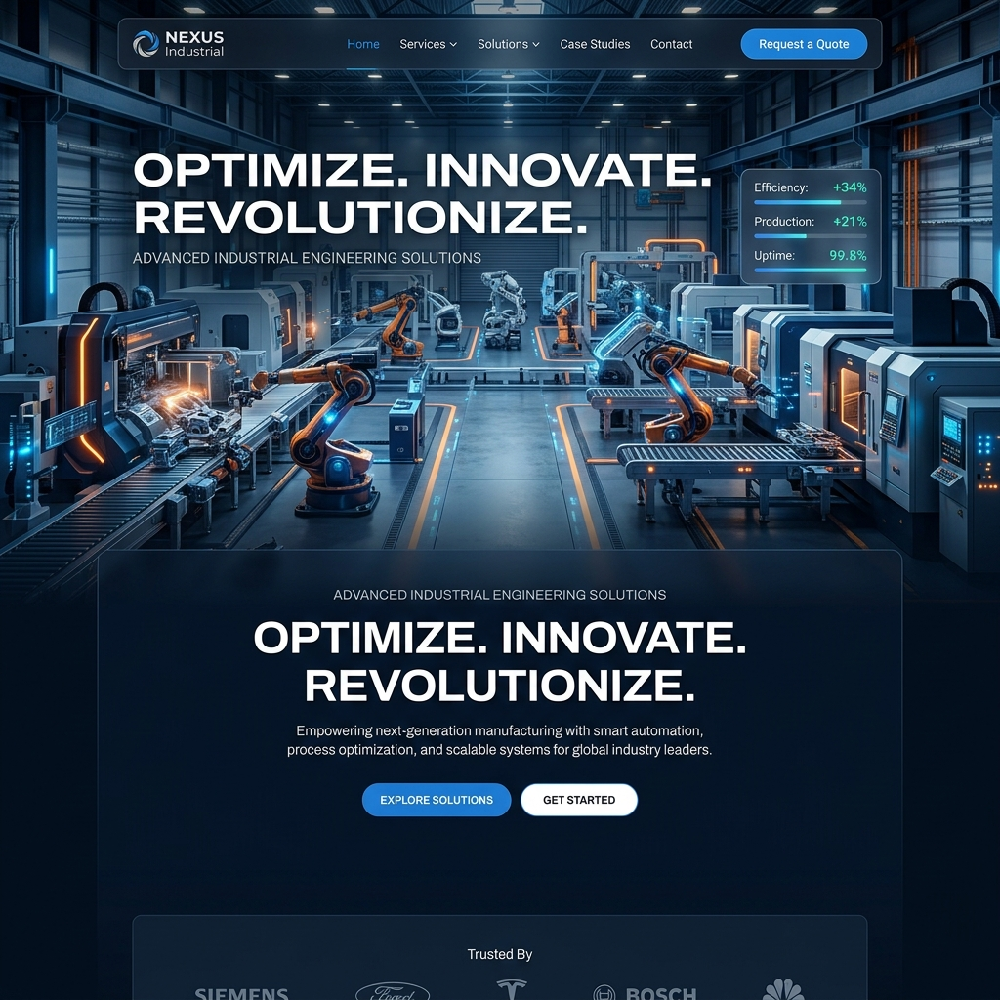
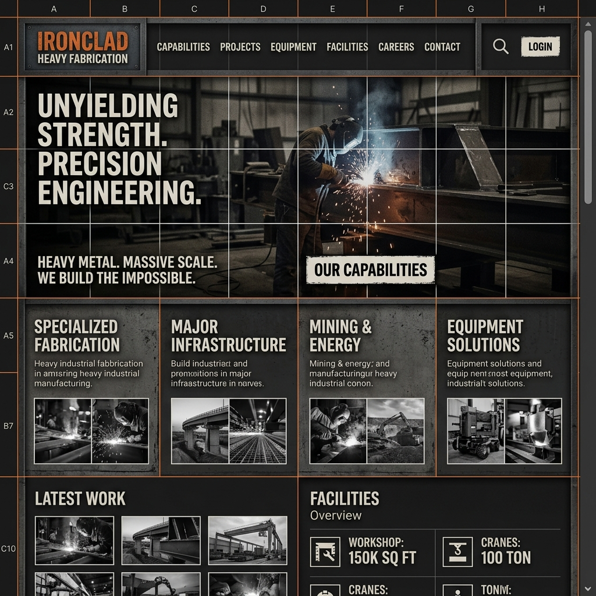
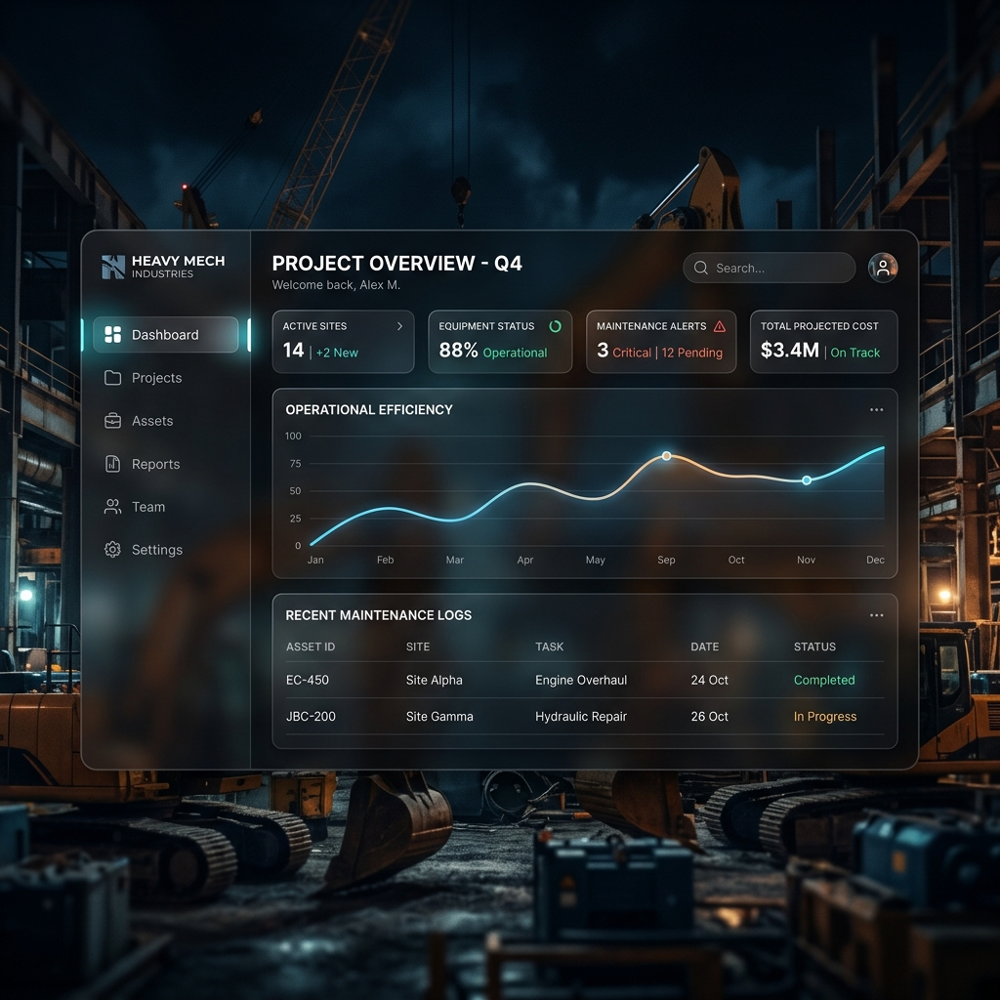
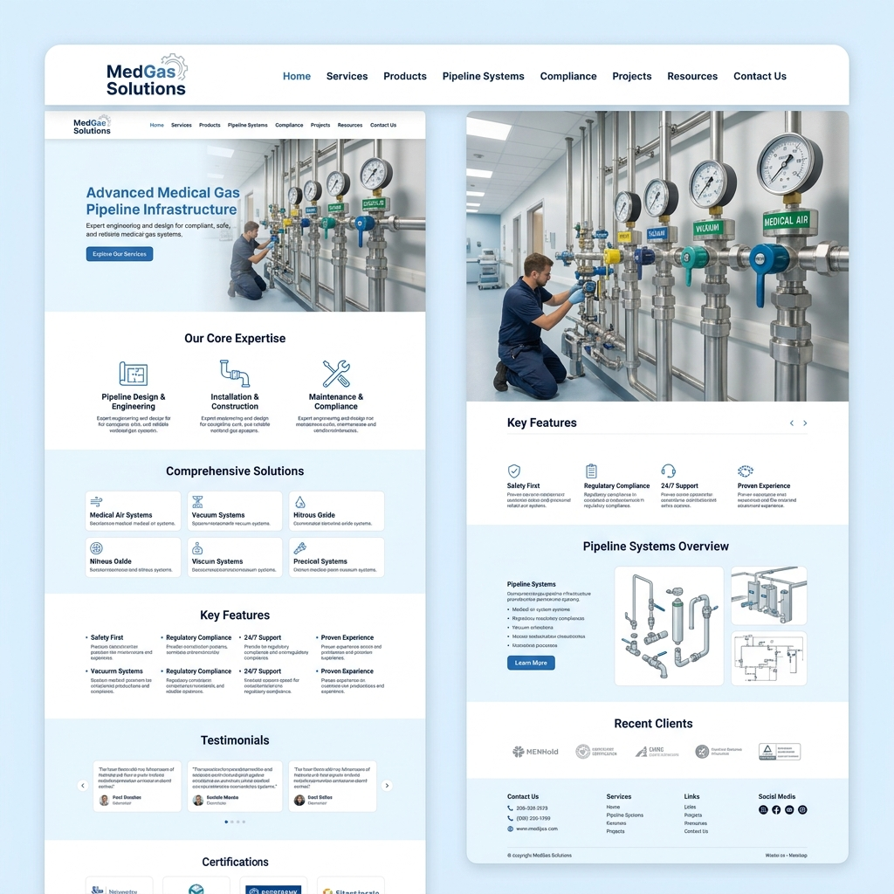

# UI Design Reference Inspiration

Here are 5 distinct visual directions for your industrial website frontend. I've placed all of these images in a new folder at `d:\Class 12\company\references\`.

````carousel

<!-- slide -->

<!-- slide -->

<!-- slide -->

<!-- slide -->

````

### 1. Minimalist Monochrome
High contrast black-and-white theme with sharp orange accents. Very clean, focusing on bold typography and readability.

### 2. Immersive 3D Hero
Uses a massive 3D rendering of factory machinery as the background for the hero section. Gives a very high-tech, premium engineering feel.

### 3. Brutalist Industrial
Raw, sturdy, and strong. Features visible grid lines, raw steel textures, and harsh contrast. Perfect for heavy fabrication.

### 4. Dark Glassmorphism
Sleek dark mode using frosted glass (glassmorphism) panels over a blurred background of heavy machinery. Very modern and sophisticated.

### 5. Clean Medical Infrastructure
Designed specifically around your medical gas pipeline (MGPS) services. Uses soft blues, crisp whites, and a sterile, trustworthy layout.
