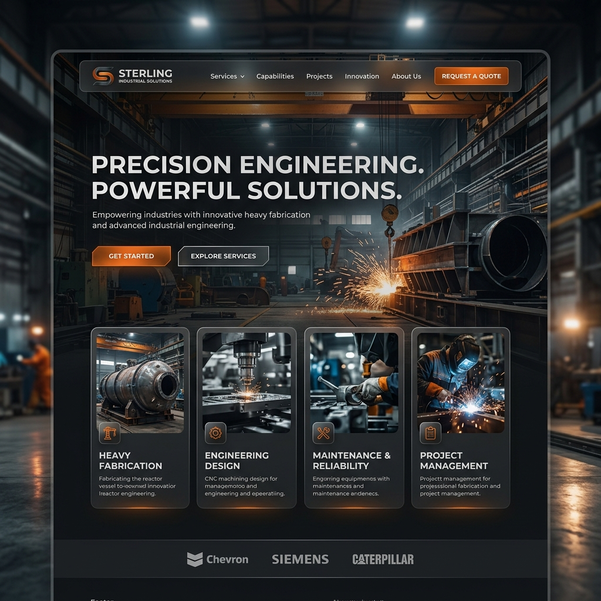

# UI/UX Improvements for Sterling Industrial Solutions

Here are 10 suggestions to improve the UI/UX of your company's website to make it feel more premium, dynamic, and engaging:

1. **Dynamic Hero Section**: Use a high-quality video background or 3D animated machinery (using `@react-three/fiber`) instead of static images. This immediately captures attention.
2. **Glassmorphism Panels**: Replace standard flat cards in the 'Services' and 'Projects' sections with semi-transparent frosted glass panels over the dark backgrounds.
3. **Metallic & Industrial Color Palette**: Shift to a sleek dark mode featuring steel grays, brushed metal textures, and vibrant safety orange or electric blue accents to represent industrial strength.
4. **Micro-animations for Interactivity**: Add subtle hover effects using `framer-motion` to service cards (e.g., slight lift, border glow, or icon animation) to make the site feel responsive and alive.
5. **Modern, Bold Typography**: Use a strong, industrial font like *Inter*, *Oswald*, or *Outfit* for headers, ensuring excellent readability and a commanding presence.
6. **Animated Statistics Counter**: Implement an animated number counter in the 'Stats' section for metrics like "Projects Completed", "Years Experience", and "Safety Record" to visually validate your expertise.
7. **High-Contrast Call-to-Actions (CTAs)**: Ensure all primary CTAs (like "Get a Quote" or "Contact Us") stand out by using a bright, contrasting color against the dark theme.
8. **Interactive Project Gallery**: Upgrade the 'ProjectsGallery' to a filterable masonry grid that allows users to seamlessly sort projects by category (Fabrication, Electrical, Medical, etc.) without page reloads.
9. **Sticky Floating Navbar**: Make the navigation bar sticky with a slight blur backdrop (backdrop-filter) on scroll, ensuring users always have access to navigation without it feeling intrusive.
10. **Scroll-Triggered Reveal Animations**: Use `framer-motion` to fade-in and slide-up elements as the user scrolls down the page, keeping the user engaged with the content flow.

